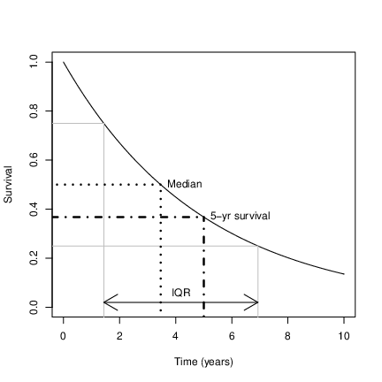

```{r setup, include=FALSE}
library(learnr)
#library(gradethis)
library("survminer")
library("survival")
knitr::opts_chunk$set(echo = FALSE)
```

# Intro to Survival Analysis

## Introduction

### Intended learning objectives
The aim of this tutorial is to review material from the lecture, in order that you may

1. Understand definitions of risk and survival

1. Understand definitions and utlity of Kaplan Meier estimation, log-rank tests and proportional hazards

1. Apply this knowledge to interpret survival analysis data when reading reports

### What you will be do 

The tutorial is a mix of reading material, instructions and questions. It is intended to be used like an exercise sheet, but will also provide instant feedback on your answers. To begin, please proceed to "Next Topic"

## Risk definitions

There are a number of fundamental quantities that are needed in survival analysis, and you need to be able to define. The first is absolute risk.

### Absolute risk

In a research study, an **absolute risk** is the probability of an outcome occurring in one group (e.g. the number participants having a heart attack over the total number of participants).

### Relative risk

A **relative risk** is the risk in the experimental group divided by the risk in a control or baseline group (also sometimes called the ‘Risk Ratio’).

A relative risk greater than 1 means the outcome was more common in the experimental group than the control/baseline group, and a RR less than 1 means it was less common.

### Hazards

Please review your lecture notes if you do not remember the definition of hazards below.

```{r question-hazard}
question_radio(
  "What is a hazard?",
  answer("rate at which some outcome of interest occurs over a given period of time (e.g. cancer diagnosis per year)", correct=TRUE),
  answer("probability that an outcome of interest occurs over a given period of time (e.g. chance of a cancer diagnosis over period)"),
  answer("rate at which some outcome of interest does not occur over a given period of time (e.g. chance of not having a cancer diagnosis over period)"),
  answer("rate at which some outcome of interest does not occur over a given period of time (e.g. not having cancer diagnosis per year)"),
  allow_retry = TRUE,
  random_answer_order = TRUE
)
```

### Hazard ratios

A **hazard ratio** is the hazard in an experimental group (exposed to the risk factor) divided by the hazard in a control or baseline group.

```{r question-hazard2}
question_radio(
  "A hazard ratio bigger than 1 means that?",
  answer("the outcome of interest has occurred at a higher rate in the experimental group than the control or baseline group", correct=TRUE),
  answer("the outcome of interest has occurred at a lower rate in the experimental group than the control or baseline group"),
  allow_retry = TRUE,
  random_answer_order = TRUE
)
```
```{r question-hazard3}
question_radio(
  "A hazard ratio smaller than 1 means that?",
  answer("the outcome of interest has occurred at a higher rate in the experimental group than the control or baseline group"),
  answer("the outcome of interest has occurred at a lower rate in the experimental group than the control or baseline group", correct=TRUE),
  allow_retry = TRUE,
  random_answer_order = TRUE
)
```

## Risk Exercise


Here is a calculator (R command window) that you might use to help you answer the below questions:
```{r evalute-calc, exercise=TRUE}

```

**Scenario** 100 patients are recruited into a trial and were randomised to receive a new drug to treat cancer. In total they are followed up for 200 person years, and 40 died. 

```{r question-absrisk1}
question_text(
  "Calculate the absolute risk of death in the trial. Enter you answer as a percentage",
  answer("40", correct=TRUE),
  answer("40%", correct=TRUE ),
  answer("20", message = "This is the mean rate, use number of patients not time at risk"),
  answer("20%", message = "This is the mean rate, use number of patients not time at risk"),
  allow_retry = TRUE,
  trim = FALSE
)
```


Another 100 patients were also recruited into a trial, and they were randomised to receive a placebo and acted as a control group. In total this group were followed up for 180 person years, and 50 died. Calculate the absolute risk of death in the trial of this group and enter it as a proportion (number between 0 and 1), or by calculating it using R code.

```{r question-absrisk2}
question_text(
  "Calculate the absolute risk of death in the trial of this group as a percentage (between 0 and 100%)",
  answer("50", correct=TRUE),
  answer("50%", correct=TRUE ),
  allow_retry = TRUE,
  trim = FALSE
)
```


```{r question-absrisk3}
question_text(
  "What was the relative risk of death for the new treatment in the trial (to at most 2 decimal places (dp))?",
  answer("0.8", correct=TRUE),
  answer("0.80", correct=TRUE ),
  answer("1.25", message = "Close, but this is the relative risk of the placebo group relative to the treated group. You need to invert your answer / reasoning."),
  allow_retry = TRUE,
  trim = FALSE
)
```

```{r question-absrisk4}
question_text(
  "What was the average hazard (or rate) of death in the placebo group (to at most 2dp)",
  answer("0.28", correct=TRUE),
  allow_retry = TRUE,
  trim = FALSE
)
```

```{r question-absrisk5}
question_text(
  "What was the average hazard (or rate) of death in the treated group? (to at most 2dp)",
  answer("0.2", correct=TRUE),
  answer("0.20", correct=TRUE),
  allow_retry = TRUE,
  trim = FALSE
)
```


```{r question-absrisk6}
question_text(
  "What is was the hazard ratio for new treatment in the trial? (to at most 2dp)",
  answer("0.72", correct=TRUE),
  answer("1.39", message="Close, but this is the relative risk of the placebo group relative to the treated group. You need to invert your answer / reasoning. "),
  answer("0.8", message="Almost, but this is the relative risk, not the hazard ratio. Make sure to use your answers above and take the ratio."),
  allow_retry = TRUE,
  trim = FALSE
)
```


Notice that the relative risk and the hazard ratio are not the same. **Do you understand why they differ?**

## Survival functions

### Recap of survival function features

Do you remember what a survival function measures?

```{r question-survival}
question_radio(
  "A survival function gives the probability that an individual will..",
  answer("have the event at a fixed (given) time"),
  answer("not have event at a fixed (given) time"),
  answer("have the event through time (ie. as a function of time)"),
  answer("do not have event through time (ie. as a function of time)", correct = TRUE),
  allow_retry = TRUE,
  random_answer_order = TRUE
)
```

The following graph shows a survival function plotted againt time, and identifies certain features that may be determined.

```{r ssa-logo, fig.align = 'center', out.width = "75%", fig.cap = "An annotated survival curve"}

```

### Exercise

Two survival functions are presented in the below figure. Please try to answer the questions about this chart, using the summary chart above if needed.

```{r gg-oz-gapminder, fig.cap = "Figure for questions", results=FALSE, echo=FALSE, hide=TRUE}
myt<-seq(0,120,by=0.1)

plot(myt, 1-pexp(myt,.03), xlim=c(0,80), type="l", lwd=3, ylab="Survival", xlab="Time (years)")
axis(1, at=seq(0,80,by=10), labels=seq(0,80,by=10))
lines(myt, 1-pexp(myt,.055), col=2, lty=2, lwd=3)

sapply(seq(0,1, by=0.05), function(idx) lines(c(-10,100),c(idx,idx), lty=3, col="darkgray"))
sapply(seq(0,85, by=5), function(idx) lines(c(idx,idx),c(-1,1), lty=3, col="darkgray"))

legend("topright", c("Group 1", "Group 2"),col=c(1,2), lty=c(1,2), lwd=3, bg="white")

```


```{r question}
question_text(
  "What is approximate median survival in group 1?",
  answer("24", message = "Almost! A bit less"),
  answer("22", message = "Almost! A bit more"),
  answer("12", message = "Are you looking at group 2?"),
  answer("23", correct = TRUE),
  answer("23y", correct = TRUE),
  allow_retry = TRUE,
  trim = FALSE
)
```

```{r question2}
question_text(
  "What is approximate median survival in group 2?",
  answer("13", message = "Almost! A bit less"),
  answer("11", message = "Almost! A bit more"),
  answer("23", message = "Are you looking at group 21"),
  answer("12", correct = TRUE),
  answer("12y", correct = TRUE),
  allow_retry = TRUE,
  trim = FALSE
)
```
```{r question3}

question_text(
  "What is approximate interquartile range in group 1 (write as x-y)?",
  answer("9-46", message = "Almost! Lower bound a little too low. Answer is 10-46"),
  answer("10-47", message = "Almost! Upper bound a little too high. Answer is 10-46"),
  answer("11-46", message = "Almost! Lower bound a little too high. Answer is 10-46"),
  answer("10-45", message = "Almost! Upper bound a little too low. Answer is 10-46"),
  answer("10-46", correct = TRUE),
  answer("10-46y", correct = TRUE),
  allow_retry = TRUE,
  trim = FALSE
)

```
```{r question4}

question_text(
  "What is approximate interquartile range in group 2 (write as x-y)?",
  answer("4-25", message = "Almost! Lower bound a little too low. Answer is 5-25"),
  answer("5-26", message = "Almost! Upper bound a little too high. Answer is 5-25"),
  answer("6-25", message = "Almost! Lower bound a little too high. Answer is 5-25"),
  answer("5-24", message = "Almost! Upper bound a little too low. Answer is 5-25"),
  answer("5-25", correct = TRUE),
  answer("5-25y", correct = TRUE),
  allow_retry = TRUE,
  trim = FALSE
)

```

```{r question5}

question_text(
  "What percentage (between 0 and 100) of group 1 are dead by 40y?",
  answer("69", message = "Almost! Answer is 70%"),
  answer("71", message = "Almost! Answer is 70%"),
  answer("69%", message = "Almost! Answer is 70%"),
  answer("71%", message = "Almost! Answer is 70%"),
  answer("70", correct = TRUE),
  answer("70%", correct = TRUE),
  allow_retry = TRUE,
  trim = FALSE
)

```

```{r question6}

question_text(
  "What percentage (between 0 and 100) of group 2 are dead by 40y?",
  answer("90", message = "Almost! Answer is 89%"),
  answer("88", message = "Almost! Answer is 89%"),
  answer("90%", message = "Almost! Answer is 89%"),
  answer("88%", message = "Almost! Answer is 89%"),
  answer("89", correct = TRUE),
  answer("89%", correct = TRUE),
  allow_retry = TRUE,
  trim = FALSE
)

```

 
```{r questionrelriskg2}

question_text(
  " Using your answers above, work out the relative risk of death in G2 relative to G1 at 40y? (to 2dp)",
  answer("1.27", correct=TRUE),
  answer("0.79", message = "Almost, but you have given the relative risk of G1 relative to G2, rather than G2 relative to G1  need 0.89 / 0.70"),
  answer("90%", message = "Almost! Answer is 89%"),
  answer("88%", message = "Almost! Answer is 89%"),
  answer("89", correct = TRUE),
  answer("89%", correct = TRUE),
  allow_retry = TRUE,
  trim = FALSE
)

```

## Estimating survival

### Kaplan-Meier definition

```{r question-kmest}
question_radio(
  "What is the Kaplan-Meier estimator used for?",
  answer("To estimate the cumulative hazard"),
  answer("To check proportional hazards"),
  answer("To calculate a p-value to compare two groups"),
  answer("To estimate the survival function", correct=TRUE),
  allow_retry = TRUE,
  random_answer_order = TRUE
)
```
### Excercise

Next consider an example of survival (time to death) in patients with Acute Myelogenous Leukemia, stratified by whether or not  the standard course of chemotherapy was extended ('maintainance') for additional cycles. Kaplan Meier estimates are shown below. 

```{r gg-aml, fig.cap = "KM plot", results=FALSE, echo=FALSE, hide=TRUE, warning=FALSE}

ggsurvplot(survfit(Surv(time, status) ~ x, aml),
           val = TRUE, conf.int = FALSE,
          ## risk.table = TRUE, # Add risk table
           linetype = "strata", # Change line type by groups
           ##fun = "event",
          ##surv.median.line="hv",
           palette = c("#E7B800", "#2E9FDF"),
            ggtheme = theme_bw(),
           title="Acute Myelogenous Leukemia survival")
```


```{r question-kmest2}
question_radio(
  "What happens at each jump in the curves?",
  answer("A patient died at that followup time", correct=TRUE),
  answer("A patient was censored"),
  answer("The patient received chemotherapy"),
  allow_retry = TRUE,
  random_answer_order = TRUE
)
```


```{r question-kmest3b}
question_checkbox(
  "If you look at the jumps in the curves through time you can see they change. Why do you think this might be?",
  answer("If several events happen at the same time the jump size will be larger", correct=TRUE),
  answer("When fewer patients are at risk with longer follow-up and censoring jump sizes increase ", correct=TRUE),
  answer("If several events happen at the same time the jump size will be smaller"),
  answer("When fewer patients are at risk with longer follow-up and censoring jump sizes decreases"),
  allow_retry = TRUE,
  random_answer_order = TRUE
)
```

```{r question-kmest3}
question_radio(
  "What do the crosses on the survival lines represent?",
  answer("A patient died at that followup time"),
  answer("A patient was censored", correct=TRUE),
  answer("The patient received chemotherapy"),
  allow_retry = TRUE,
  random_answer_order = TRUE
)
```


```{r question-kmest5}
question_radio(
  "Which group lived longer?",
  answer("Maintained ", correct=TRUE),
  answer("Non maintained"),
  allow_retry = TRUE,
  random_answer_order = TRUE
)
```


```{r gg-aml2, fig.cap = "KM plot", results=FALSE, echo=FALSE, hide=TRUE, warning=FALSE}

ggsurvplot(survfit(Surv(time, status) ~ x, aml),
           val = TRUE, conf.int = FALSE,
          ## risk.table = TRUE, # Add risk table
           linetype = "strata", # Change line type by groups
           ##fun = "event",
          surv.median.line="hv",
           palette = c("#E7B800", "#2E9FDF"),
            ggtheme = theme_bw(),
           title="Acute Myelogenous Leukemia survival")
```


 Using the above modified plot, determine the approximate difference in median survival between the two groups.

```{r question6pt2}

question_text(
  "Using the above modified plot, determine the approximate difference in median survival between the two groups (to nearest percent).",
  answer("8", correct=TRUE),
  answer("9", correct=TRUE),
  allow_retry = TRUE,
  trim = FALSE
)

```
 
## Testing for differences between two survival curves

A log-rank test was used to calculate the p-vaue shown in the figure below.

```{r gg-aml3, fig.cap = "KM plot", results=FALSE, echo=FALSE, hide=TRUE, warning=FALSE}

ggsurvplot(survfit(Surv(time, status) ~ x, aml),
           pval = TRUE, conf.int = FALSE,
          ## risk.table = TRUE, # Add risk table
           linetype = "strata", # Change line type by groups
           ##fun = "event",
           palette = c("#E7B800", "#2E9FDF"),
            ggtheme = theme_bw(),
           title="Acute Myelogenous Leukemia survival")
```

```{r question-kmest4}
question_radio(
  "What null hypothesis does this test?",
  answer("Survival is the same in the two groups ", correct=TRUE),
  answer("Survival is different in the two groups"),
  answer("The median survival is the same in the two groups"),
  answer("The median survival is different in the two groups"),
  allow_retry = TRUE,
  random_answer_order = TRUE
)
```

## Proportional hazards regression model

Another way to quantify difference in survival is the mean hazard ratio. This is often estimated using a so-called *Cox model*.

```{r question-ph1}
question_radio(
  "What is the main assumption of the Cox model?",
  answer("Normal distribution"),
  answer("Constant rate"),
  answer("Proportional hazards", correct=TRUE),
  answer("Large sample size"),
  allow_retry = TRUE,
  random_answer_order = TRUE
)
```


```{r, echo=FALSE}
## general functions
fn.format<-function(ind, ndigit=2)
{
        format(round(ind,ndigit), nsmall=ndigit)
    }
fn.formatci<-function(inp, inci1, inci2, ndig=2, notxt=TRUE)
  {
    if(notxt){
        paste(fn.format(inp, ndig), " (95%CI ", fn.format(inci1,ndig), " to ", fn.format(inci2,ndig), ")", sep="")
    }
    else
    {
        paste(fn.format(inp, ndig), "% (", fn.format(inci1,ndig), " to ", fn.format(inci2,ndig), "%)", sep="")
    }
}
t.coxph <- coxph(Surv(time, status)~x, aml)

t.confint<-confint(t.coxph)

thistxt <- fn.formatci(exp(coef(t.coxph)), exp(t.confint[1]), exp(t.confint[2]))
```


```{r question-hazard2a}

question_text(
  "What value of the hazard ratio (a number) corresponds to having the same mean hazard in each of the two groups?",
  answer("0", message = "Not correct. This would mean that one group had no risk of the event."),
  answer("1", correct = TRUE),
  answer("1.0", correct = TRUE),
  allow_retry = TRUE,
  trim = FALSE
)

```

 In the Acute Myelogenous Leukemia data introduced above the estimated hazard ratio in the non-maintained group, compared with the maintained group, was `r thistxt`.


```{r question-hazard2b}

question_text(
  "What is the most likely value of the hazard ratio based on the results?",
  answer("0.92", message = "Not correct. This is the lower 95%CI limit."),
  answer("6.81", message = "Not correct. This is the upper 95%CI limit."),
  answer("2.50", correct = TRUE),
  answer("2.5", correct = TRUE),
  allow_retry = TRUE,
  trim = FALSE
)

```


```{r question-hazard2c}

question_text(
  "Informally, based on the results one might say that the hazard ratio might be as large as what?",
  answer("0.92", message = "Not correct. This is the lower 95%CI limit."),
  answer("6.81", correct=TRUE ),
  answer("6.8", correct=TRUE ),
  answer("2.50", message="This is the most likely value (point estimate), consider using the 95%CI as a measure of uncertainty in the results"),
  answer("2.5", message="This is the most likely value (point estimate), consider using the 95%CI as a measure of uncertainty in the results"),
  allow_retry = TRUE,
  trim = FALSE
)

```

```{r question-phpval}
question_radio(
  "How might you describe these results?",
  answer("The hazard or rate of death is about 2.5 greater in the non-maintained group, indicating a large and important effect that is highly likely to be true"),
  answer("The hazard or rate of death could be as much as 6 times greater in the non-maintained group, indicating a large and important effect that is highly likely to be true"),
  answer("The hazard or rate of death is about 2.5 greater in the non-maintained group, and could be as much as approximately 6.8 times or even less likely (0.92). This suggests caution is needed, and further data would help increase precision. ", correct=TRUE),
  answer("We cannot say whether the rate of death is increased or not because a 95%CI for the hazard ratio crosses 1.0, and so P>0.05 and the results are statisticially insignificant"),
  allow_retry = TRUE,
  random_answer_order = TRUE
)
```


### Checking proportional hazards assumption

The plot below may be used to verify the proportional hazards assumption between the two groups. 

```{r gg-aml4, fig.cap = "Cumulative hazard (Nelson-Aalan) plot using log scale", results=FALSE, echo=FALSE, hide=TRUE, warning=FALSE}
aml <- aml[order(aml$time),]
myNA0<-survfit(Surv(time,status)~1, aml[order(aml$time),][aml$x=="Maintained",])
myNA2<-survfit(Surv(time,status)~1, aml[aml$x=="Nonmaintained",])

##plot(fit$time*100, cumsum(fit$n.event/fit$n.risk), type="l", col=2)                                                                                                                
myrt<-myNA2$n.event /myNA2$n.risk
mysig<-sqrt(cumsum(myNA2$n.event / (myNA2$n.risk^2)))
myH2<-cumsum(myrt)

myrt0<-myNA0$n.event /myNA0$n.risk
mysig0<-sqrt(cumsum(myNA0$n.event / (myNA0$n.risk^2)))
myH20<-cumsum(myrt0)

myrt<-myNA2$n.event /myNA2$n.risk
mysig<-sqrt(cumsum(myNA2$n.event / (myNA2$n.risk^2)))
myH2<-cumsum(myrt)

plot(myNA2$time, myH2, type="l", lwd=3, xlab="Time", ylab="Cumulative Hazard (log scale)", log="y", ylim=c(min(myH2, myH20), max(myH2, myH20)))
grid()
lines(myNA0$time, myH20,  lwd=3, col=2, log="y")
legend("bottomright", lty=c(1,1), col=c(1,2), c("Maintained", "Not Maintained"), lwd=c(3,3))


```
```{r question-phlog}
question_radio(
  "Do you think that proportional hazards is reasonable based on this plot? Why?",
  answer("No, the lines are not close to each other"),
  answer("Yes, the lines are increasing"),
  answer("Yes, the lines appear approximately parallel, with a constant gap, which indicates proportional hazards", correct=TRUE),
  answer("No, the lines do not cross each other"),
  allow_retry = TRUE,
  random_answer_order = TRUE
)
```
To answer this question you may need to review material from the lecture.

## Conclusion

This is the end of the tutorial.
